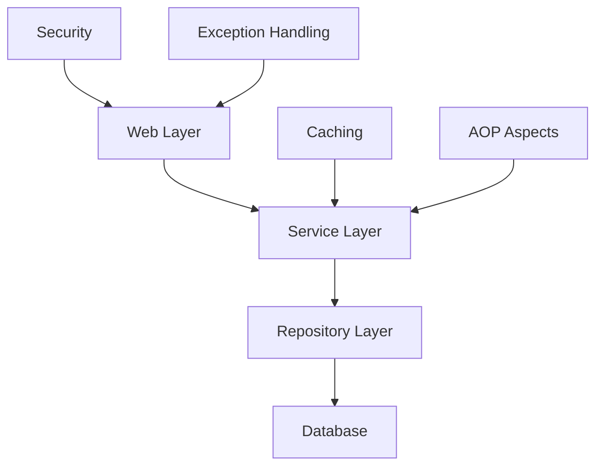

# 🏛️ 架構設計指南

## 概覽

本節詳細介紹 Spring Boot 資源庫的整體架構設計理念、技術選型和實現細節。

## 📚 文檔結構

### [整體架構設計](architecture-design/)
- 分層架構設計理念
- 領域驅動設計 (DDD) 應用
- 微服務架構準備
- 設計模式實踐

### [技術棧說明](tech-stack/)
- 核心技術選型依據
- 版本兼容性說明
- 性能特性分析
- 生產環境建議

### [開發環境設置](dev-environment/)
- 本地開發環境配置
- IDE 設置和插件推薦
- 程式碼品質工具配置
- Docker 開發環境

### [部署策略](deployment/)
- 開發/測試/生產環境配置
- Docker 容器化部署
- CI/CD 流程設計
- 監控和日誌策略

## 🎯 設計原則

### 1. 企業級特性
- **可擴展性**: 模組化設計，支持水平和垂直擴展
- **可維護性**: 清晰的程式碼結構和完整的文檔
- **可測試性**: 依賴注入和模擬測試支持
- **可觀測性**: 完整的日誌、監控和健康檢查

### 2. 現代化實踐
- **云原生**: 12-factor app 原則
- **DevOps**: 自動化 CI/CD 流程
- **安全**: 多層安全防護機制
- **性能**: 快取、異步處理、資料庫優化

### 3. 開發效率
- **模板化**: 可重用的專案模板
- **自動化**: 程式碼生成和重複任務自動化
- **標準化**: 統一的程式碼風格和 API 設計
- **文檔化**: 自動生成的 API 文檔

## 🔧 核心組件

### Web Layer (Controller)
- RESTful API 設計
- 統一回應格式
- 資料驗證
- API 文檔生成

### Service Layer (業務邏輯)
- 業務規則實現
- 事務管理
- 快取控制
- 事件發布

### Repository Layer (資料存取)
- JPA/Hibernate ORM
- 自定義查詢
- 資料庫事務
- 連線池管理

### 橫切關注點
- **AOP**: 日誌、審計、效能監控
- **Security**: 認證、授權、資料保護
- **Caching**: Redis 分散式快取
- **Exception Handling**: 全域異常處理

## 📈 效能特性

### 1. 資料庫優化
- 連線池配置 (HikariCP)
- 索引策略設計
- 查詢優化
- 分頁處理

### 2. 快取策略
- 多層快取架構
- Redis 集群支持
- 快取失效策略
- 快取預熱

### 3. 異步處理
- Spring Async 支持
- 事件驅動架構
- 消息隊列整合
- 背景任務處理

## 🔒 安全架構

### 1. 認證與授權
- JWT Token 機制
- OAuth2 支持
- 角色基礎存取控制 (RBAC)
- API 金鑰管理

### 2. 資料保護
- 敏感資料加密
- SQL 注入防護
- XSS 防護
- CSRF 保護

### 3. 網路安全
- HTTPS 強制
- CORS 配置
- 速率限制
- IP 白名單

## 📊 監控與觀測

### 1. 健康檢查
- Spring Boot Actuator
- 自定義健康指標
- 依賴服務檢查
- 資源使用監控

### 2. 日誌管理
- 結構化日誌 (JSON)
- 日誌級別控制
- 錯誤追蹤
- 效能日誌

### 3. 指標收集
- Micrometer 整合
- 自定義指標
- JVM 監控
- 業務指標

## 🚀 擴展性設計

### 1. 模組化
- 功能模組分離
- 依賴管理
- 插件架構
- 配置外部化

### 2. 水平擴展
- 無狀態服務設計
- 負載均衡支持
- 資料庫讀寫分離
- 分散式快取

### 3. 垂直擴展
- 資源配置彈性
- JVM 調優
- 連線池優化
- 記憶體管理

---

選擇您感興趣的主題深入了解架構設計的細節！